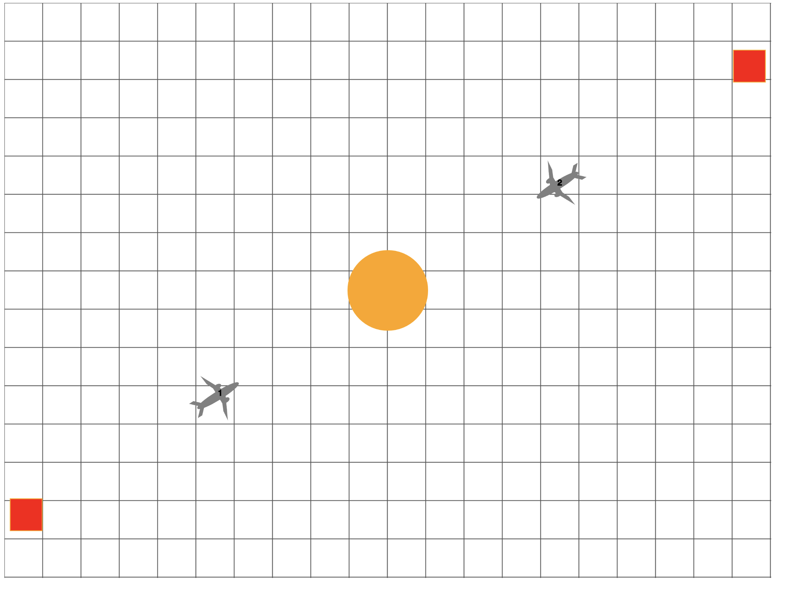
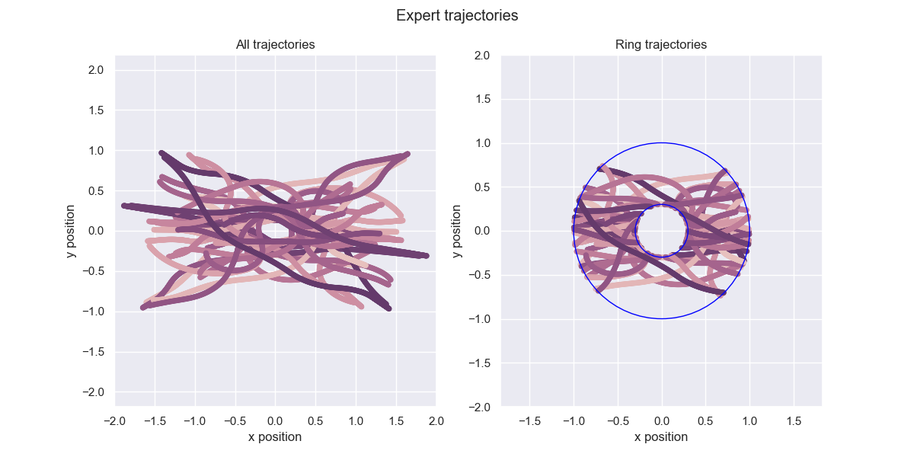

# Airplane Simulation

## TL;DR

First, install node.js.  Then start the node server by running `node server.js` from the `Sim/` directory.  Open an internet browser; the simulation should be running at <http://localhost:3000>.  Complete a simulation by moving the airplane on the left hand side to the red square on the right side of the screen.  You can control the airplane using the arrow keys; `left` and `right` control the velocity whereas `up` and `down` control the angular velocity.  Once you're done, the simulation will stop, and you can run `python parse.py --name <your-name>` to process the data
from the simulation.  To collate the results of all trials, you can run `python extract_ring.py`; the results from this collations are saved to the `final_results/collated` directory.

## Dependencies

The first step is to install the dependencies.  For this simulation, the only
dependency is `node.js`, which is a JavaScript runtime framework.  If you're
running on a Mac or on a Windows machine, you can download an installer from
<https://nodejs.org/en/>.  If you're running Ubuntu, you can run

```bash
sudo apt install nodejs
```
I assume that something similar would work on other Linux distributions.

## Running the simulation

From the `Sim/` directory, run

```bash
node server.js
```
This will start a node server running on a localhost.  You can open an internet
browser and go to <http://localhost:3000> or <http://127.0.0.1:3000/>.  The simulation should be running.
You should see something like this:



## Controlling the airplane(s)

The simulation is set up so that the airplane on the right side mimics the
behavior of the airplane on the left side.  So just imagine that you're controlling
the left hand side airplane.

To control that airplane, you use the four arrow keys.  The `left` and `right` arrow
keys control your speed.  The `left` arrow key slows you down and the `right` arrow key
speeds you up.  There are caps on both of these values, so you can't reach the speed
of light.

To adjust the angular velocity, you can use the `up` and `down` arrow keys.  The
`up` arrow key will increase the angular velocity in the counterclockwise direction,
whereas the `down` arrow will increase the angular velocity in the clockwise direction.

## Saving the data

Your goal is to move the left airplane to the red square on the opposite side of the
grid while not passing through the orange circle.  Once you hit the red square on
the opposite of the grid, the simulation will stop.  You can also manually stop the
simulation at any time by hitting the `enter` key, although as of now you cannot restart
the simulation after hitting `enter`.

Once the simulation stops, you can run

```python
python parse.py --name <your-name>
```

to load all of the data into python and save it to `.npy` files so we can use it
for training the neural networks.  A plot of your expert trajectory will appear
in the `./data` folder, as will the `.npy` files.  Make sure to change the `<your-name>`
to your actual name when running.

## Naming convention

I'm saving all trajectories in the `final_results` folder.  Right now, I'm thinking
that a reasonable system would be to make a folder in the `final_results/trials` folder
with your name (i.e. `alex/`).  Then create separate folders within the folder with your
name on it to keep track of different trajectories.  `parse.py` will do this
automatically with the name you supply with the `--name` flag.

## Extracting data in the N-ring

To extract data that lies within the N-ring, run

```python
python extract_ring.py
```

This will first collate all the data from different names and trials into a single DataFrame.  Then it will create a new DataFrame with all of the data that lies within the N-ring.  All of this data is saved as np arrays in the `final_results/collated` directory.  Also, a plot showing all of the expert trajectories will be saved in this directory.  This plot should look like the following:


